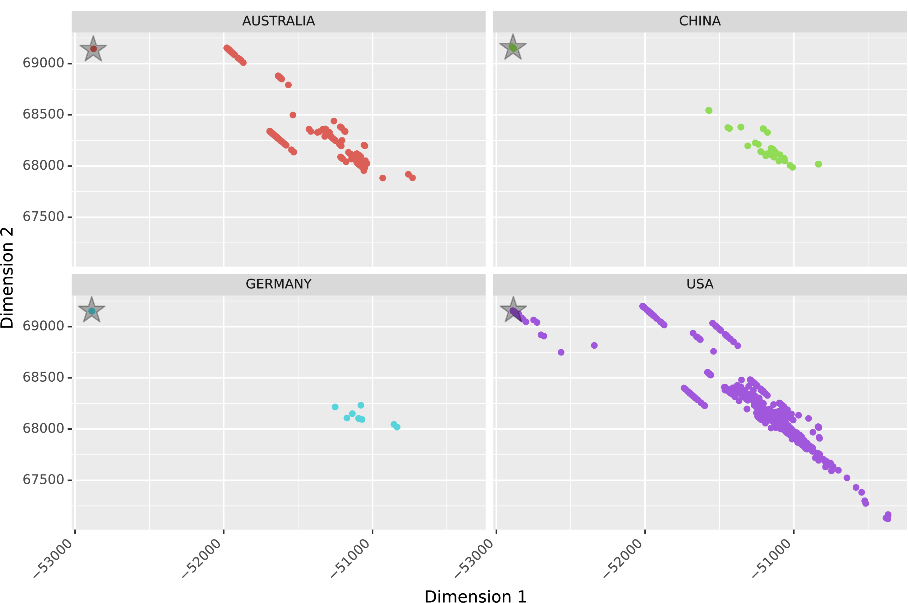

# Autoencoder-based-representation-learning-on-SARS-Cov-2-RNA-genome-sequences

Author: Dong Liang

E-mail: ldifer@gmail.com

The novel coronavirus disease (COVID-19) started in late 2019 has developed into a global pandemic, posing an immediate and ongoing threat to the health and economic activities of billions of people today. The severe acute respiratory syndrome coronavirus 2 (SARS-CoV-2), which causes COVID-19, is characterized by rapid and efficient individual to individual transmission with a range of clinical courses including severe acute respiratory distress syndrome, viral pneumonia, mild upper respiratory infection (URIs) and asymptomatic carriers.  Covariates associated with worse outcome include hypertension, diabetes, coronary heart disease and older age. Study on COVID-19 cases on the Diamond Princess cruise ship in Japan estimates the proportion of asymptomatic patients to be 17.9% (95% CrI: 15.5-20.2%). All these present great challenges for prevention and control of the COVID-19 transmission.

There clear evidences that the SARS-Cov-2 is evolving rapidly. A recent phylogenetic network analysis of 160 SARS-Cov-2 genomes identified three central variants based on amino acid changes. Yet, Tang et al found that two SNPs in strong linkage disequilibrium at location 8,782 (orf1ab: T8517C, synonymous) and 28,144 (ORF8: C251T, S84L) can form haplotypes that classified SARS-CoV-2 viruses into two major lineages (L and S types). Mutations also frequently occur in the receptor-binding domain (RBD) in the spike protein that mediates infection of human cells. An recent analysis of the viral genomes of 6,000 infected people identified one mutation (named D614G) in the spike protein to be associated with increased virus transmissibility. Obviously, the dynamic evolution of virus genome would have important effects on the spread, pathogenesis and immune intervention of SARS-CoV-2.

Machine learning methods have been successfully applied to classify different types of cancer and identify potentially valuable disease biomarkers. In addition, the convolutional neural networks (CNNs) has been developed into the method of choice for medical images recognition and classification. Its special convolution and pooling architectures and parameter sharing mechanism make it computationally more efficient compared to the traditional fully connected neural networks. Albeit with its great popularity in various computer vision tasks, the CNN is less commonly employed in the field of genome sequence analysis. This study attempted to use the state-of-the-art CNN-based autoencoder and perform representation learning on 3161 full-length RNA genome sequences of SARS-Cov-2 collected from across various U.S. states and the world. The model prototype developed in this study could serve as a first step in developing disease risk scoring system in the future.

***Figure** Representation learning-based classification of RNA genomes of the spreading SARS-CoV-2 in four major countries. The stars at the top left corner indicate where locates the reference genome of the virus (Accession ID: NC_045512 ).*

